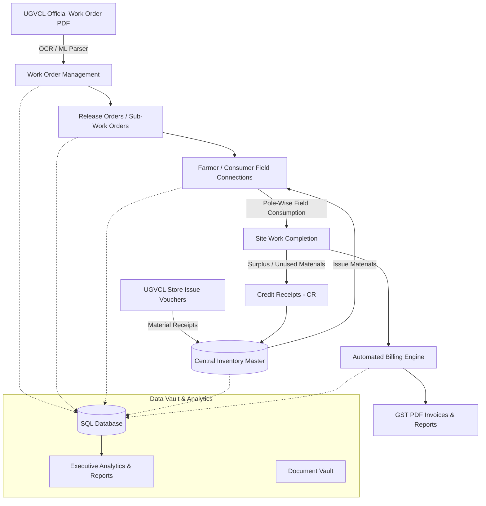
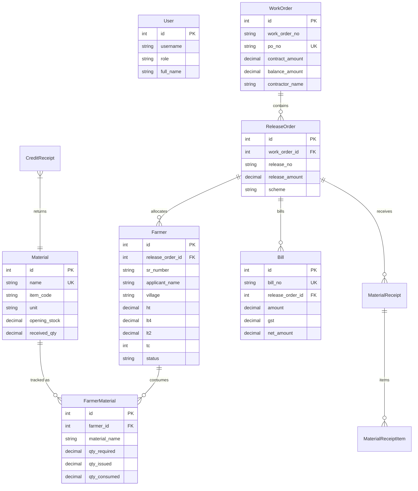

# ⚡ UGVCL Portal Contract Manager

[](https://www.python.org/)
[](https://flask.palletsprojects.com/)
[](https://www.mysql.com/)
[](https://adminlte.io/)
[](https://scikit-learn.org/)
[](#)

> **Enterprise-grade ERP & Operations Management System** specifically designed for electrical engineering contractors executing power distribution, rural electrification, and infrastructure projects under **Uttar Gujarat Vij Company Limited (UGVCL)**.

---

## 📌 Table of Contents

- [Overview & Problem Statement](#-overview--problem-statement)
- [Key Features](#-key-features)
- [System Architecture & Workflow](#-system-architecture--workflow)
- [Core Functional Modules](#-core-functional-modules)
- [AI / ML & OCR Document Ingestion](#-ai--ml--ocr-document-ingestion)
- [Database Schema (ERD)](#-database-schema-erd)
- [Technology Stack](#-technology-stack)
- [Project Directory Structure](#-project-directory-structure)
- [Installation & Quick Start](#-installation--quick-start)
- [Environment Configuration](#-environment-configuration)
- [GitHub Repository](#-github-repository)

---

## 📖 Overview & Problem Statement

Government utility contracts with UGVCL involve complex, multi-tiered operations:
1. Managing **Main Work Orders (WO)** and **Purchase Orders (PO)** worth crores of rupees.
2. Issuing **Release Orders (Sub-Work Orders)** under specific electrification schemes (ND, Agricultural, General).
3. Constructing field lines for hundreds of **Farmer/Consumer connections** across various villages (High-Tension `HT`, Low-Tension `LT-4`/`LT-2`, and Transformer Centers `TC`).
4. Maintaining **Central Warehouse Material Inventory** (reconciling store receipts, dispatches, consumption, and credit returns).
5. Generating **Departmental GST Invoices** and official **Progress Reports**.

The **UGVCL Portal Contract Manager** digitizes and automates this entire pipeline into a unified, secure web application with real-time stock reconciliation and ML-powered document parsing.

---

## ✨ Key Features

- 📑 **Comprehensive Contract Management:** Live tracking of tender references, POs, sanctioned amounts, and balance burn-down.
- ⚡ **Consumer / Farmer Lifecycle Tracking:** Village-wise consumer lists with technical line parameters (`HT km`, `LT4 km`, `LT2 km`, `TC count`) and status progression (`Pending` ➔ `Material Issued` ➔ `Started` ➔ `Completed`).
- 📦 **Dynamic Central Inventory Ledger:** Real-time stock calculation:
  $$\text{Current Stock} = \text{Opening Stock} + \text{Received Qty} - \max(\text{Issued Qty}, \text{Consumed Qty}) + \text{Credit Receipts (CR)}$$
- 🤖 **AI / OCR Scanners:** Pre-trained ML classifiers (`scikit-learn` / `joblib`) + OCR (`PyMuPDF`, `pytesseract`) to automatically extract PO numbers, dates, amounts, and item tables from uploaded government PDFs.
- 🔄 **Credit Receipts (CR) & Surplus Handling:** Track unused or dismantled material returned from sites back to the central store.
- 🧾 **Automated Milestone Billing:** Instant generation of GST-compliant PDF bills (via ReportLab) and multi-sheet Excel reports (via openpyxl).
- 🗄️ **Digital Document Vault:** Categorized cloud/local vault for work orders, release orders, store issue vouchers, test certificates, and site photos.

---

## 🏗️ System Architecture & Workflow



---

## 🧩 Core Functional Modules

| Module | Description |
| :--- | :--- |
| **1. Auth & RBAC** | User login, session management (`Flask-Login`), role permissions (Admin, Contractor Manager), and user profile customization. |
| **2. Work Orders** | Tracks primary contract POs, tender IDs, RFQ/PR numbers, sanctioned budgets, and real-time balance amounts. |
| **3. Release Orders** | Sub-allocations per scheme (e.g. ND scheme), tracking sanctioned values vs. cumulative site expenditures. |
| **4. Farmer Connections** | Technical survey details: Applicant Name, Village, Date, HT Line (km), LT-4 (km), LT-2 (km), TC, and work stages. |
| **5. Central Inventory** | Dynamic stock ledger, item aliases & code mappings, warehouse receipts, site dispatches, and live debit/credit callouts. |
| **6. Credit Receipts (CR)** | Surplus and dismantled field material recovery logs to maintain 100% audit-proof inventory records. |
| **7. Billing & Invoicing** | Automated rate calculations, CGST/SGST/IGST breakdown, and official PDF bill generation formatted to UGVCL standards. |
| **8. ML & OCR Scanner** | Smart classifier identifying document types and extracting line items from scanned PDF tender and store issue sheets. |
| **9. Document Vault** | Secure repository for contracts, sub-orders, estimates, test sheets, invoices, and inspection photographs. |
| **10. Analytics Dashboard** | Real-time KPIs, visual progress charts (`Chart.js`), budget burn-down curves, and material deficit alerts. |

---

## 🤖 AI / ML & OCR Document Ingestion

The application incorporates a machine learning and computer vision pipeline for automated ingestion of official utility paperwork:

* **Document Classifier (`doc_classifier.joblib`):** Automatically classifies incoming PDF documents into Work Orders, Release Orders, or Store Issue Vouchers.
* **Extraction Models:**
  * `work_order_model.joblib` – Extracts PO numbers, tender references, approval numbers, and contract amounts.
  * `sub_work_order_model.joblib` – Extracts release numbers, scheme codes, and allocated values.
  * `inventory_model.joblib` – Parses tabular store receipt data, item descriptions, and issued quantities.
* **OCR Fallback Engine (`PyMuPDF` + `pytesseract`):** Performs text and tabular extraction on low-resolution scanned documents.

---

## 🗄️ Database Schema (ERD)



---

## 🛠️ Technology Stack

* **Backend:** Python 3.11+, Flask, Flask-Login, Flask-SQLAlchemy, Flask-Migrate, Flask-WTF
* **Database:** SQLite (Local Dev) / MySQL 8.0+ (Production Ready with PyMySQL)
* **Frontend:** AdminLTE 3, Bootstrap 5, FontAwesome 6, Chart.js, DataTables, HTML5/CSS3
* **Machine Learning & OCR:** Scikit-Learn, Joblib, PyMuPDF (`fitz`), `pdfplumber`, `pytesseract`, `Pillow`
* **Spreadsheet & PDF Generation:** `pandas`, `openpyxl`, `xlrd`, `xlwt`, `reportlab`

---

## 📂 Project Directory Structure

```text
ugvcl-portal-contract-manager/
├── app/
│   ├── auth/              # Authentication routes & login handlers
│   ├── inventory/         # Central inventory & stock ledger routes
│   ├── main/              # Main dashboard & overview routes
│   ├── manager/           # Manager role specific views & actions
│   ├── work_orders/       # Work order & release order routes
│   ├── services/          # OCR, Excel generators & ML scanners
│   ├── static/            # CSS, JS, vendor libraries, uploaded assets
│   ├── templates/         # Jinja2 HTML templates (AdminLTE 3 UI)
│   ├── extensions.py      # SQLAlchemy, LoginManager extensions
│   ├── models.py          # Database models (SQLAlchemy ORM)
│   └── __init__.py        # Flask app factory
├── config.py              # Application configuration & DB connection
├── run.py                 # Application entry point
├── requirements.txt       # Python package dependencies
├── doc_classifier.joblib  # Trained document classification ML model
├── work_order_model.joblib# Work order ML extraction model
├── sub_work_order_model.joblib # Release order ML extraction model
├── inventory_model.joblib # Inventory voucher ML model
├── uploads/               # Uploaded PDFs, images & generated bills
├── .env.example           # Example environment variables
└── README.md              # Project documentation
```

---

## 🚀 Installation & Quick Start

### Prerequisites
* **Python 3.11+** installed on your system
* **Git** installed
* *(Optional)* **Tesseract OCR** installed if running OCR on scanned images

### 1. Clone the Repository
```bash
git clone https://github.com/sahilbgs/UGVCL-contract-manager-.git
cd UGVCL-contract-manager-
```

### 2. Create and Activate a Virtual Environment
* **On Windows:**
  ```powershell
  python -m venv venv
  venv\Scripts\activate
  ```
* **On Linux / macOS:**
  ```bash
  python3 -m venv venv
  source venv/bin/activate
  ```

### 3. Install Dependencies
```bash
pip install -r requirements.txt
```

### 4. Setup Environment Variables
Copy `.env.example` to `.env` and adjust the settings:
```bash
# Windows
copy .env.example .env

# Linux / macOS
cp .env.example .env
```

### 5. Initialize the Database & Run
```bash
# Start the Flask development server
python run.py
```
Open your browser and navigate to: **`http://127.0.0.1:5000`**

---

## ⚙️ Environment Configuration

| Variable | Default Value | Description |
| :--- | :--- | :--- |
| `SECRET_KEY` | `dev-secret-key-change-in-production` | Flask session encryption key |
| `DATABASE_URL` | `sqlite:///ugvcl_contract_manager.db` | Database connection URI (SQLite or MySQL) |
| `FLASK_ENV` | `development` | Environment mode (`development` / `production`) |
| `UPLOAD_FOLDER` | `uploads` | Directory for storing uploaded PDFs and documents |

---

## 🔗 GitHub Repository

* **Repository:** [https://github.com/sahilbgs/UGVCL-contract-manager-.git](https://github.com/sahilbgs/UGVCL-contract-manager-.git)
* **Author / Maintainer:** [sahilbgs](https://github.com/sahilbgs)
