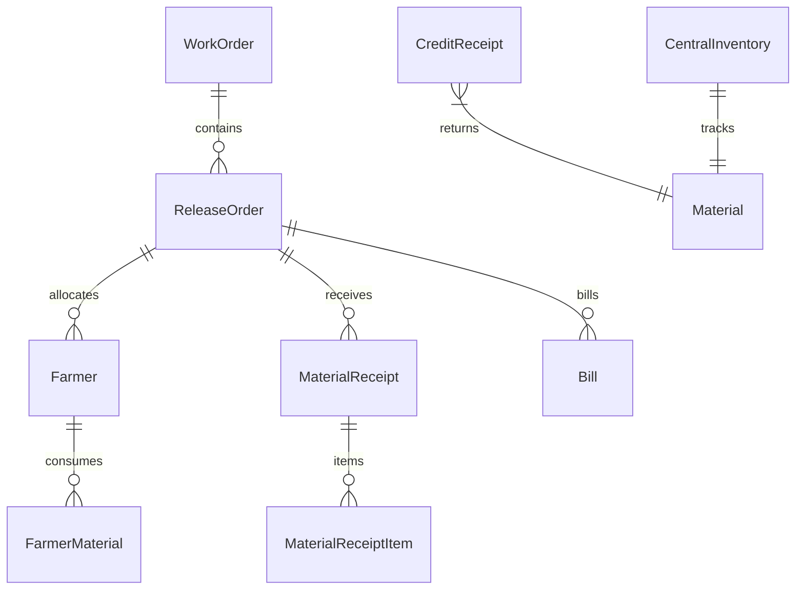

# UGVCL Portal Contract Manager - Implementation Plan

This document outlines the design and implementation details for the UGVCL Portal Contract Manager, covering all 12 core modules and the auto-workflow system.

## Goal Description
Build a web application for electrical contract managers working with Uttar Gujarat Vij Company Limited (UGVCL). The app automates work order tracking, release order parsing, farmer uploads, material tracking (central inventory), work allocation, material consumption, credit receipts (unused material returns), billing automation, and document vault storage.

---

## Technical Stack
- **Backend**: Python, Flask, Flask-Login (Authentication), SQLAlchemy (ORM).
- **Database**: MySQL (production-ready). The app will automatically connect to a local MySQL instance if configured via environment variables; otherwise, it will fall back to SQLite for instant local execution.
- **Frontend**: AdminLTE 3 (Admin Dashboard framework) + Bootstrap 5 + FontAwesome (Icons) + Chart.js (Interactive Reports).
- **Libraries**:
  - `pdfplumber` + `pytesseract` + `fitz` (PyMuPDF) for scanned PDF OCR.
  - `pandas` + `openpyxl` + `xlrd` for importing and exporting Excel files.
  - `reportlab` for generating professional PDF bills.

---

## Proposed Database Schema

We will define the following database models in `models.py`:

### 1. `User`
- `id`: Integer, PK
- `username`: String (unique)
- `password_hash`: String

### 2. `WorkOrder`
- `id`: Integer, PK
- `work_order_no`: String (e.g. "WO-6203")
- `po_no`: String (unique index, e.g. "102600")
- `tender_id`: String
- `rfq_no`: String
- `pr_no`: String
- `approval_no`: String
- `contract_amount`: Decimal
- `balance_amount`: Decimal (starts at contract_amount, decreases as release orders are uploaded)
- `contractor_name`: String
- `start_date`: Date
- `end_date`: Date
- `pdf_path`: String
- `created_at`: DateTime

### 3. `ReleaseOrder`
- `id`: Integer, PK
- `work_order_id`: Integer (FK to `WorkOrder`)
- `release_no`: String (e.g. "1")
- `release_date`: Date
- `po_no`: String
- `release_amount`: Decimal
- `remaining_amount`: Decimal (tracked directly from release PDF)
- `scheme`: String (e.g. "ND")
- `pdf_path`: String
- `created_at`: DateTime

### 4. `Farmer`
- `id`: Integer, PK
- `release_order_id`: Integer (FK to `ReleaseOrder`, nullable)
- `sr_number`: String (e.g. "14625068")
- `applicant_name`: String
- `village`: String
- `date`: Date (nullable)
- `ht`: Decimal (High Tension line length in km)
- `lt4`: Decimal (Low Tension 4-wire line length in km)
- `lt2`: Decimal (Low Tension 2-wire line length in km)
- `tc`: Integer (Transformer Centre count)
- `status`: String (default 'Pending') -- 'Pending', 'Material Issued', 'Started', 'Completed'
- `created_at`: DateTime

### 5. `FarmerMaterial` (Required materials per farmer)
- `id`: Integer, PK
- `farmer_id`: Integer (FK to `Farmer`)
- `material_name`: String (e.g. "PSC Pole 8 MTR")
- `qty_required`: Decimal
- `qty_issued`: Decimal (default 0)
- `qty_consumed`: Decimal (default 0)

### 6. `Material` (Inventory items definition)
- `id`: Integer, PK
- `name`: String (unique)
- `unit`: String (e.g. "Nos", "Mtr", "Kg")
- `opening_stock`: Decimal (default 0)
- `received_qty`: Decimal (default 0)
- `issued_qty`: Decimal (default 0)
- `consumed_qty`: Decimal (default 0)
- `current_stock`: Decimal (calculated: `opening_stock + received_qty - issued_qty - consumed_qty`)

### 7. `MaterialReceipt`
- `id`: Integer, PK
- `release_order_id`: Integer (FK to `ReleaseOrder`, nullable)
- `receipt_no`: String
- `date`: Date
- `created_at`: DateTime

### 8. `MaterialReceiptItem`
- `id`: Integer, PK
- `receipt_id`: Integer (FK to `MaterialReceipt`)
- `material_name`: String
- `qty`: Decimal
- `rate`: Decimal

### 9. `CreditReceipt` (Unused material returns)
- `id`: Integer, PK
- `cr_number`: String
- `date`: Date
- `material_name`: String
- `qty`: Decimal
- `created_at`: DateTime

### 10. `Bill`
- `id`: Integer, PK
- `bill_no`: String
- `release_order_id`: Integer (FK to `ReleaseOrder`)
- `date`: Date
- `amount`: Decimal
- `gst`: Decimal
- `net_amount`: Decimal
- `pdf_path`: String
- `status`: String (default 'Pending') -- 'Pending', 'Paid'
- `created_at`: DateTime

### 11. `DocumentVault`
- `id`: Integer, PK
- `doc_type`: String (e.g. "Work Order", "Release Order", "Farmer Excel", "Material Receipt", "Bill", "CR", "Photo")
- `filename`: String
- `file_path`: String
- `related_id`: Integer (nullable reference to related WorkOrder, ReleaseOrder, Bill, etc.)
- `uploaded_at`: DateTime

---

## Core Module Features & Logic

### Module 1 & 2: PDF Parsing and OCR Logic
Scanned PDFs have no text data. Our backend parser (`ocr_parser.py`) will:
1. Convert PDF pages to high-DPI images in memory using PyMuPDF (`fitz`).
2. Run OCR using `pytesseract` to extract raw text.
3. Extract key details using robust regular expressions:
   - **Work Order**:
     - `PO No`: `PO\.?\s*NO?\s*:\s*(\d+)`
     - `Tender ID`: `Tender\s*ID\s*:\s*(\d+)`
     - `RFQ No`: `RFQ\s*NO?\s*\.?\s*:\s*(\d+)`
     - `PR No`: `PR\s*NO?\s*\.?\s*:\s*(\d+)`
     - `Approval No`: `Approval\s*No\.?\s*:\s*([^\n]+)`
     - `Contract Amount`: Look for target amount text matching patterns like `A.T. Amount is` or net value totals (e.g., `10,76,015`).
     - `Contractor Name`: Grab the name from lines following `TO,`.
     - `Work Order No`: Extracted from filename or reference `AT-6203` (interpreted as `WO-6203`).
   - **Release Order**:
     - `Release No`: `Release\s*No\s*:\s*(\d+)`
     - `Release Date`: `Release\s*Date\s*:\s*([\w\-]+)`
     - `PO No`: `PO\s*No\s*:\s*(\d+)`
     - `Release Amount`: `Release\s*Amount\s*[\D]*\s*([\d\.]+)`
     - `Remaining Amount`: `Remaining\s*Amount\s*[\D]*\s*([\d\.]+)`
     - `Scheme`: `SCHEME-([A-Z0-9]+)`

### Module 3: Farmer Excel Upload Logic
The parser (`excel_parser.py`) will read the uploaded file:
1. **Flat Excel**: If the sheet contains columns like `SR Number`, `Applicant Name`, `Village`, `Date`, `HT`, `LT4`, `LT2`, `TC`, it imports the rows directly.
2. **UGVCL Detailed Material Sheet** (like `sample lt.xls` sheets `page-1` to `page-9`):
   - Scans rows. Location rows are identified where Column 0 has a serial number and Column 2 has text containing `SR.NO.` (e.g. `THAKOR SHIVAJI JOGJI - JUNA NESDA     SR.NO. 14625068`).
   - Extracts `Applicant Name` (Thakor Shivaji Jogji), `Village` (Juna Nesda), and `SR Number` (14625068) using regex.
   - For all subsequent rows until the next location, it aggregates the materials:
     - `LT2`: Sum of column `Conducto 34mm 2wire` or `Conductor 34mm 2wire`
     - `LT4`: Sum of column `Conductor 34mm 4wire`
     - `HT`: Sum of column `Conductor 55 mm 3wire`
     - `TC`: Sum of columns starting with `Transformer`
     - All material columns (Poles, stay wires, bolts, insulators, etc.) are compiled and saved in `FarmerMaterial` table as the exact required quantities for that farmer! This ensures fully automated inventory tracking of all materials.

### Module 4: Excel-Like Data Entry
An interactive web-based grid (handsontable or a clean HTML/JS grid) will allow users to:
- Direct edit, insert, or delete farmer rows manually.
- Automatically save changes to the database.

### Module 5 & 6 & 8 & 9: Material Receipt, Inventory, Consumption, and returns
- **Material Receipt (MR)**: Adds quantity to central inventory (`received_qty`).
- **Material Issuance**: When a farmer's status changes to `Material Issued`, the required material quantities are subtracted from warehouse inventory (increased in `issued_qty` of `Material`).
- **Material Consumption**: When a farmer's status changes to `Completed`, the materials move from `Issued` to `Consumed` (no double-subtraction; `issued_qty` decreases, `consumed_qty` increases).
- **Credit Receipt (CR)**: Unused material returns. Adds returned quantity back to inventory (`received_qty` increases, or tracks as a positive adjustment).
- **Stock Formula**:
  `Current Stock = Opening Stock + Received - Issued - Consumed + Credit Receipt (Returned)`

### Module 10: Billing Automation
1. The user selects a Release Order.
2. The system fetches all completed farmers associated with that Release Order.
3. It aggregates their quantities: total HT, LT4, LT2, TC.
4. Using default or customized rates, it calculates the net amount, 18% GST, and net total.
5. In one click, a styled PDF bill is generated using `reportlab` and saved to the Document Vault.

### Module 11: Document Vault
A centralized file manager where all uploaded PDFs, Excel sheets, and generated PDF bills are searchable by keywords, date, type, or PO No.

### Module 12: Dashboard
Highlights key metrics:
- Total Contract Value vs. Released Value vs. Balance.
- Total Farmers vs. Completed.
- Stock Value and listing.
- Pending vs. Paid Bills.
- Visual charts: Contract balance breakdown (donut chart), work allocation progress (bar chart), stock level alerts.

### Best Feature: Auto Workflow
A single upload form where users can upload:
1. Main Work Order PDF
2. Release Order PDF
3. Farmer Excel
The system runs PDF OCR, extracts PO No, creates the Work Order and Release Order, links them, runs the Excel importer, links the farmers to the Release, generates the inventory requirements, and sets them to "Ready for Work".

---

## User Review Required
> [!IMPORTANT]
> - **Database fallback**: The app will default to SQLite in the workspace folder (`ugvcl_contract_manager.db`) if MySQL is not configured in the `.env` file, allowing instant pair programming runs.
> - **OCR Fallback**: Since scanned PDF OCR is never 100% perfect due to scanning noise, the user will be presented with a preview of the extracted fields before they are saved, allowing manual correction of any mismatched values.

---

## Verification Plan

### Automated Tests
We will write tests in `tests/test_flow.py` and run them using `pytest`:
`pytest tests/test_flow.py`
This will test:
- PDF OCR text parsing mock-ups.
- Excel parser logic using `sample lt.xls`.
- Database inventory calculation formulas (Receipt -> Issuance -> Completion -> Return).
- Billing generation.

### Manual Verification
- Deploy the Flask server locally (`python app.py`).
- Open `http://localhost:5000` in the browser.
- Perform the Auto Workflow upload with the PDFs and Excel in the workspace.
- Review the extracted Work Order, Release, and Farmers.
- Walk through material receipt, allocation, status updates, CR return, and bill generation.
